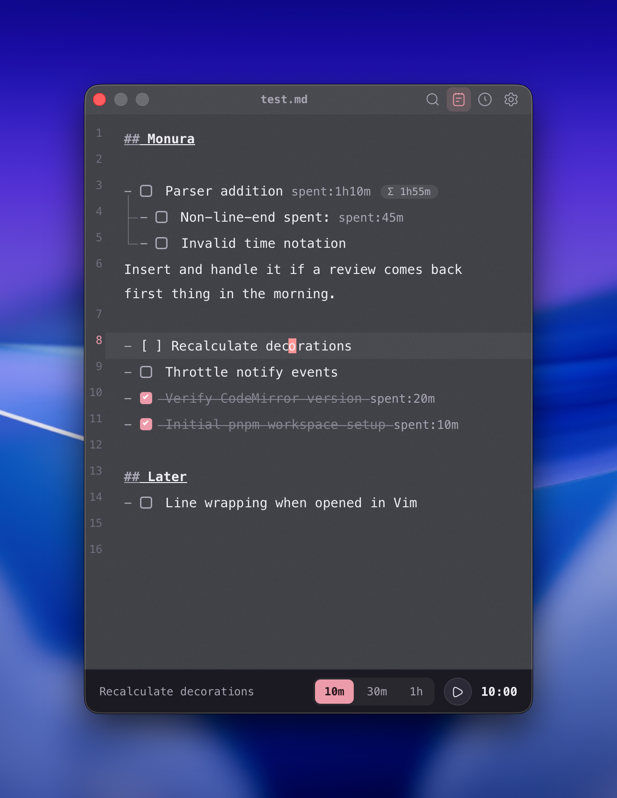

<p align="center">
  
</p>

<h1 align="center">Monura</h1>

<p align="center">
  <strong>Markdown + TODO + Timer.</strong>
</p>

<p align="center">
  <a href="https://monura-site.ellreka.workers.dev/">Live Demo</a> &middot;
  <a href="https://github.com/ellreka/monura/releases">Download</a>
</p>

<p align="center">
  
</p>

## Why Monura?

Task management should not require an account, a database, or a proprietary format. Monura works directly with the Markdown files you already own and tracks only the time you actually spend.

Use any editor, folder structure, Git workflow, or sync tool. Monura is a focused layer on top of plain text, not a replacement for it.

## Download

| Platform              | Package                  |
| --------------------- | ------------------------ |
| macOS — Apple Silicon | `Monura_*_aarch64.dmg`   |
| Windows — x64         | `Monura_*_x64-setup.exe` |

Download the latest build from [GitHub Releases](https://github.com/ellreka/monura/releases). Intel Macs, Windows on ARM, and Linux are not currently packaged.

The builds are not code-signed by Apple or Microsoft:

- **macOS:** Try to open Monura once, then go to **System Settings → Privacy & Security → Open Anyway**.
- **Windows:** In Microsoft Defender SmartScreen, choose **More info → Run anyway** after verifying that you downloaded it from this repository's GitHub Releases page.

## Getting Started

1. Choose a folder containing your Markdown files.
2. Open an existing `.md` file or create one.
3. Write tasks as Markdown checklists.
4. Place the cursor on a task line, choose a timer preset, and start tracking.
5. Stop the timer to append the tracked duration as `spent:`.

```markdown
- [ ] Ship the next release +monura spent:20m
  - [ ] Test the updater spent:15m
  - [x] Write release notes spent:5m
```

## Features

**Plain Markdown.** Tasks are standard `- [ ]` and `- [x]` lines. No hidden IDs or separate task database.

**Preset timers.** Work in deliberate 10-minute, 30-minute, or 1-hour blocks. Presets and shortcuts are customizable.

**Task hierarchy.** Indented checklists form parent and child tasks. Aggregate time is calculated for display without modifying parent task lines.

**Session history.** Review tracked time by month, day, or `+project` tag.

**Keyboard-first.** CodeMirror editing, configurable shortcuts, and built-in Vim mode.

**Fully local.** Task data stays on your machine, and changes made in external editors are detected automatically. There is no account, sync backend, or telemetry.

## Data

| Data            | Location                                            |
| --------------- | --------------------------------------------------- |
| Markdown        | The folder you choose; this is the source of truth  |
| Session history | Monthly JSONL files in the Tauri app data directory |
| Settings        | The Tauri app data directory                        |

## Build from Source

Requires Node.js 24, pnpm 10, stable Rust, and the [Tauri system prerequisites](https://v2.tauri.app/start/prerequisites/).

```bash
git clone https://github.com/ellreka/monura.git
cd monura
pnpm install --frozen-lockfile
pnpm tauri dev
```

Useful commands:

```bash
pnpm test
pnpm lint
pnpm build
pnpm tauri build
pnpm --dir site build
```

Built with React 19, TypeScript, CodeMirror 6, Rust, and Tauri 2.

## Release

Pushing a `v*.*.*` tag triggers `.github/workflows/release.yml` and creates a draft release for macOS and Windows.

1. Set the same version in `package.json`, `src-tauri/tauri.conf.json`, and `src-tauri/Cargo.toml`.
2. Run `cargo check --manifest-path src-tauri/Cargo.toml` to update Cargo metadata.
3. Commit the version change, then push the matching tag.

```bash
git tag v0.0.2
git push origin v0.0.2
```
